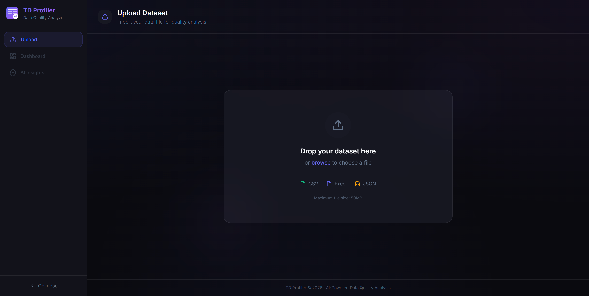
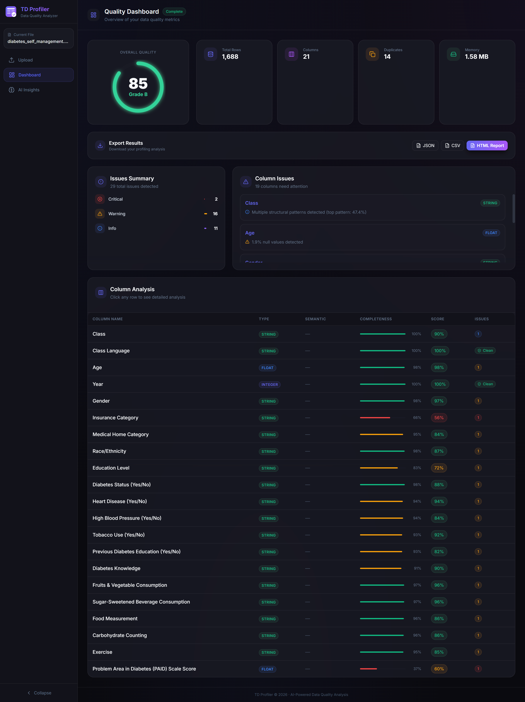
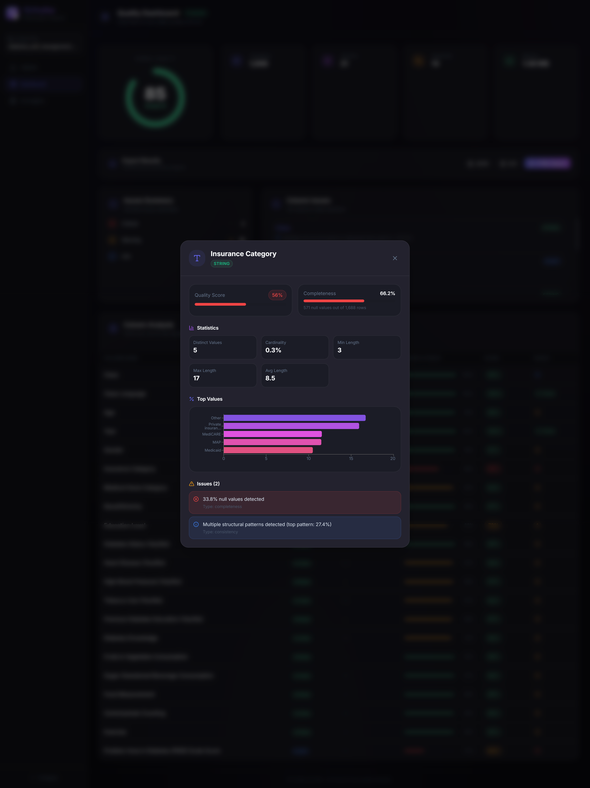
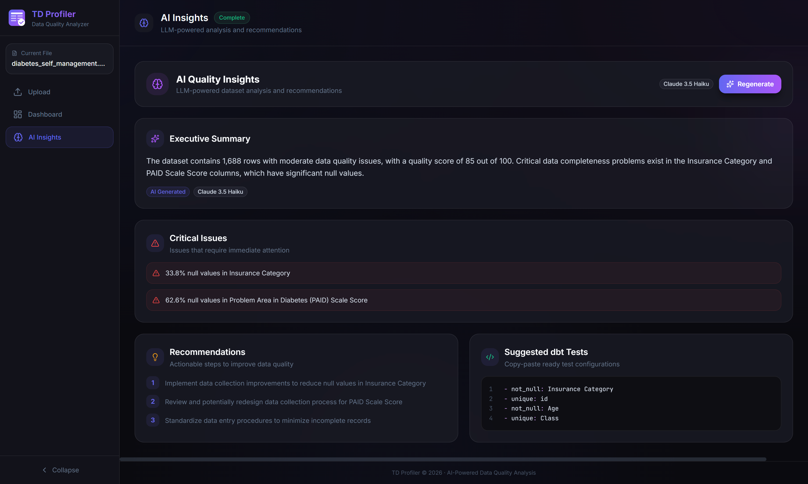

# TD Profiler

**AI-Powered Tabular Data Quality Analyzer**

Upload your CSV, Excel, or JSON files and get instant insights into data quality, patterns, outliers, and AI-generated recommendations.


## Features

- **Deep Profiling** — Comprehensive statistics, null analysis, cardinality, and outlier detection for every column
- **AI-Powered Insights** — Get intelligent recommendations and critical issue detection powered by Claude
- **Quality Scoring** — Automatic data quality scores with completeness, validity, and consistency metrics
- **dbt Integration** — Auto-generated dbt test configurations ready to copy-paste into your project
- **Export Options** — Download reports as JSON, CSV, or HTML

## Screenshots

### Dashboard Overview
Quality scores, column statistics, and issue summary at a glance.



### Column Profiling
Detailed statistics, top values distribution, and data type inference.



### Column Detail Modal
Deep dive into any column with charts, statistics, and detected issues.



### AI Insights
LLM-powered analysis with executive summary, critical issues, recommendations, and suggested dbt tests.



## Tech Stack

**Frontend**
- React 19 + TypeScript
- Vite
- Tailwind CSS v4
- Recharts
- Framer Motion

**Backend**
- FastAPI (Python)
- Pandas
- LangChain + Anthropic Claude

## Quick Start

### Prerequisites
- Python 3.10+
- Node.js 18+
- Anthropic API key

### Backend Setup
```bash
cd backend
python -m venv venv

# Windows
.\venv\Scripts\Activate.ps1
# macOS/Linux
source venv/bin/activate

pip install -r requirements.txt

# Create .env file
echo "ANTHROPIC_API_KEY=your_key_here" > .env

uvicorn app.main:app --reload --port 8001
```

### Frontend Setup
```bash
cd frontend
npm install
npm run dev
```

The app will be available at `http://localhost:5173`

## API Endpoints

| Method | Endpoint | Description |
|--------|----------|-------------|
| POST | `/api/upload` | Upload file for profiling |
| GET | `/api/profile/{job_id}` | Get profiling results |
| GET | `/api/insights/{job_id}` | Generate AI insights |
| GET | `/api/report/{job_id}?format=json\|csv\|pdf` | Export report |

## Rate Limits

To prevent abuse, the following limits apply:
- **File uploads**: 5 per hour per IP
- **AI insights**: 3 per hour per IP
- **Max file size**: 5 MB

## License

MIT
